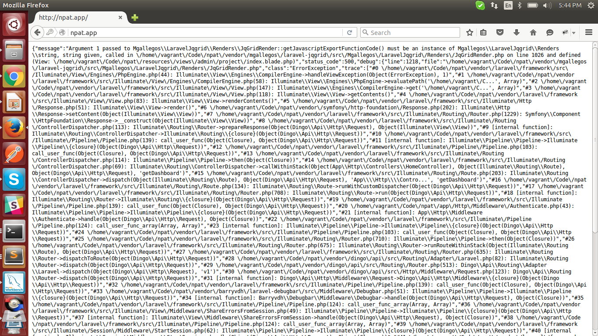

## Laravel PHP Framework

How to install: Navigators Performance Analysis Tool(NPAT)

Step 1: Get the code - Download the repository
Clone NPAT and run on your terminal

Run command on terminal:
example :
git clone https://Puneethkb@bitbucket.org/compassitesinc/npat.git

Step 2: Use Composer to install dependencies in the NPAT
		Run command on terminal : 

		composer install

step 3: Setting up .env file

		->Rename the .env.examples to .env
		->Then goto terminal and run command : 
                                    php artisan key:generate

step 4: Creating database and running migrations

		->Configure the .env file, by entering database name,username ,password
		->Same with conif/database.php file
		->Now go to teminal and run :
                                                    php artisan migrate
		->And then run: 
						    php artisan db:seed

For any error of laravel jqgrid error update composer "mgallegos/laravel-jqgrid": "dev-master" to "mgallegos/laravel-jqgrid": "1.*" and run composer update command.

## Official Documentation

Documentation for the framework can be found on the [Laravel website](http://laravel.com/docs).

## Contributing

Thank you for considering contributing to the Laravel framework! The contribution guide can be found in the [Laravel documentation](http://laravel.com/docs/contributions).

## Security Vulnerabilities

If you discover a security vulnerability within Laravel, please send an e-mail to Taylor Otwell at taylor@laravel.com. All security vulnerabilities will be promptly addressed.

### License

The Laravel framework is open-sourced software licensed under the [MIT license](http://opensource.org/licenses/MIT)
